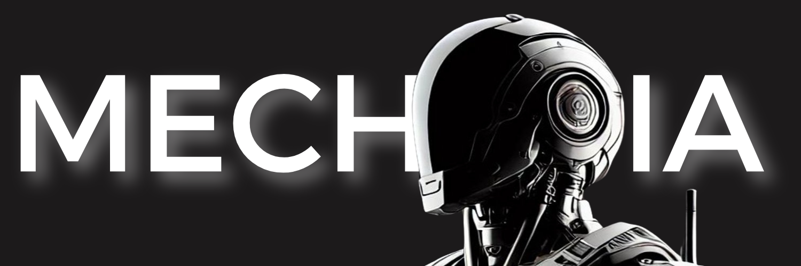

# MECHIA - Your AI Mechanical Engineer

Welcome to **MECHIA**, an advanced AI agent designed to solve complex mechanical problems with precision and efficiency. MECHIA is your trusted partner for:

- **Static, Cinematic, and Dynamic Analysis**: Perform detailed studies and analysis for mechanical systems.
- **Technical Q&A**: Get precise answers to technical mechanical questions.
- **2D to 3D Transformations**: Convert 2D mechanical designs into 3D STEP files with ease.

---

## Features

### 🔍 **Static, Cinematic, and Dynamic Analysis**
MECHIA provides robust tools to analyze mechanical systems, offering:
- Comprehensive static force calculations.
- Cinematic chain analysis for motion studies.
- Dynamic simulations to evaluate system behavior.

### 🛠️ **Technical Question Assistance**
Ask MECHIA technical questions, and receive:
- Accurate and detailed explanations.
- Contextual insights into complex mechanical concepts.

### 📐 **2D to 3D Design Transformation**
Transform your 2D mechanical blueprints into:
- 3D models in STEP file format.
- Ready-to-use designs for CAD applications.
---
## Contributing
We welcome contributions! To contribute:
1. Fork the repository.
2. Create a new branch for your feature or bug fix.
3. Commit your changes and push the branch.
4. Submit a pull request.
---

## Get Started
```bash
cargo add mechia-core
```

### Simple example:
```rust
use mechia::{completion::Prompt, providers::openai};

#[tokio::main]
async fn main() {
    // Create OpenAI client and model
    // This requires the `OPENAI_API_KEY` environment variable to be set.
    let openai_client = openai::Client::from_env();

    let gpt4 = openai_client.agent("gpt-4").build();

    // Prompt the model and print its response
    let response = gpt4
        .prompt("Who are you?")
        .await
        .expect("Failed to prompt GPT-4");

    println!("GPT-4: {response}");
}
```
Note using `#[tokio::main]` requires you enable tokio's `macros` and `rt-multi-thread` features
or just `full` to enable all features (`cargo add tokio --features macros,rt-multi-thread`).

## Supported Integrations

Vector stores are available as separate companion-crates:

- LanceDB vector store: [`mechia-lancedb`](https://github.com/mechiacode/mechia/tree/main/mechia-lancedb)
---
## Examples

### Static Analysis Example
Input:
```text
Analyze the forces on a beam with a point load of 50N at its center.
```
Output:
```text
Reaction forces at supports:
- Left support: 25N
- Right support: 25N
```
---
### 2D to 3D Transformation Example
Input:
- A 2D DXF file of a mechanical part.
Output:
- A 3D STEP file of the part, ready for CAD.
---
## Contact
For inquiries or support, reach out via:
- GitHub Issues: [Submit an issue](https://github.com/MECHIACODE/MECHIA/issues)
- Email: contact@mechia.fun
---
 ## License
This project is licensed under the MIT License. See the [LICENSE](https://github.com/MECHIACODE/MECHIA/blob/main/LICENSE) file for details.

---
## Stay Updated
- Follow the repository to get the latest updates and features.

